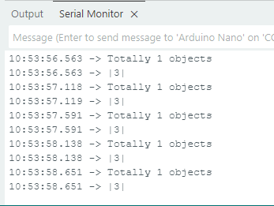
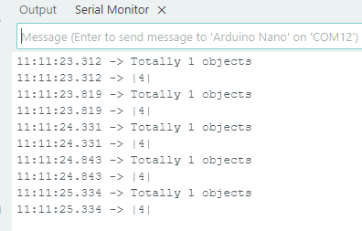

# 4.1 识别颜色

## 4.1.1 算法简介


指定一个识别区域，其位置和大小可根据需要进行设置，返回该区域的颜色标签以及红色分量值R、绿色分量值G与蓝色分量值B。

---------------------

## 4.1.2 颜色分类标签

Sengo1定义了7 种颜色的分类标签：

| 标签值 | 含义 | 标签值 | 含义 |
| :----: | :--: | :----: | :--: |
|   1    | 黑色 |   2    | 白色 |
|   3    | 红色 |   4    | 绿色 |
|   5    | 蓝色 |   6    | 黄色 |
|   0    | 未知 |        |      |

<span style="color:red;font-size:20px;">注：不在表格中的常见的颜色如紫色、青色（蓝绿色）、橙色、灰色等，其颜色区分度较低，容易误识别为表格中的颜色， 因此这几种颜色被归为未知颜色。如若需要识别以上颜色，可根据返回的RGB分量值自行进行判定。</span>

示例1：


串口标签值输出为：（可以看到识别框输出的颜色标签值为3，与表格中的标签值对应）




示例2：


串口标签值输出为：（输出的标签值也与表格对应）



-------------------------

## 4.1.3 配置参数

用户可指定识别区域坐标和识别框的大小，如未指定新的参数，则以默认值运行，参数定义如下：

|     参数      |        含义         | 默认值 |
| :-----------: | :-----------------: | :----: |
| param.x_value | 识别区域中心横坐标x |   50   |
| param.y_value | 识别区域中心纵坐标y |   50   |
|  param.width  |    识别区域宽度w    |   20   |
| param.height  |    识别区域高度h    |   20   |

代码：

```c
  sentry_object_t param;  // 参数结构体
  Serial.println("Sengo begin Success.");
  //设置识别框位置x坐标
  param.x_value = 50;
  //设置识别卡位置y坐标
  param.y_value = 50;
  //设置识别框宽
  param.width = 20;
  //设置识别框高
  param.height = 20;
  // 将参数写入传感器
  err = sengo.SetParam(VISION_TYPE, &param);
```

---------------

## 4.1.4 返回数据

主控器获取检测结果时，算法会返回以下数据：

|  形参   |          含义          |
| :-----: | :--------------------: |
| kRValue | 红色分量值R，范围0-255 |
| kGValue | 绿色分量值G，范围0-255 |
| kBValue | 蓝色分量值B，范围0-255 |
| kLabel  |      颜色分类标签      |

代码：

```c
      // 获取物体的标签（颜色ID）
      int label = sengo.GetValue(VISION_TYPE, kLabel, 1);
```

`sengo.GetValue(VISION_TYPE, kLabel, 1);`返回的是颜色分类标签值，加入我将他替换成"kRValue",`sengo.GetValue(VISION_TYPE, kRValue, 1);`那么返回是是红色分量值R（0-255）

--------------------

## 4.1.6 识别颜色算法使用技巧

1. 当识别区域较小时，譬如2x2，虽然识别速度快，但因像素点过少，结果易被干扰，其可信度较低，只适用于背景单一可控的应用场合；

2. 当识别区域较大时，譬如20x20，因像素点多，区域内杂色的干扰被会滤除，结果具有较高的可信度，但识别速度慢；

3. 当识别区域内不同颜色的面积相当时，结果可能会反复跳变；

-----------------------

## 4.1.7 代码

```c
#include <Arduino.h>
#include <Sentry.h>  // 引入Sentry机器视觉传感器库

typedef Sengo1 Sengo;  // 为Sengo2类型创建别名Sengo，简化后续使用

// 通信方式选择（通过取消注释启用其中一种）
#define SENGO_I2C  // 当前启用I2C通信
// #define SENGO_UART   // 备用选项：UART串口通信

#ifdef SENGO_I2C
#include <Wire.h>  // I2C通信所需的库
#endif

#ifdef SENGO_UART
#include <SoftwareSerial.h>               // 软串口库（用于非硬件串口）
#define TX_PIN 11                         // 自定义TX引脚
#define RX_PIN 10                         // 自定义RX引脚
SoftwareSerial mySerial(RX_PIN, TX_PIN);  // 创建软串口对象
#endif

#define VISION_TYPE Sengo::kVisionColor  // 定义视觉算法类型（颜色识别）
Sengo sengo;                             // 创建Sengo传感器对象

void setup() {
  sentry_err_t err = SENTRY_OK;  // 错误状态变量

  Serial.begin(9600);  // 初始化串口用于调试输出
  Serial.println("Waiting for sengo initialize...");

  // 根据选择的通信方式初始化传感器
#ifdef SENGO_I2C
  Wire.begin();  // 初始化I2C总线
  // 持续尝试连接直到成功
  while (SENTRY_OK != sengo.begin(&Wire)) {
    yield();  // 在等待时允许其他任务运行
  }
#endif

#ifdef SENGO_UART
  mySerial.begin(9600);  // 初始化软串口
  while (SENTRY_OK != sengo.begin(&mySerial)) {
    yield();
  }
#endif

  sentry_object_t param;  // 参数结构体
  Serial.println("Sengo begin Success.");
  //设置识别框位置x坐标
  param.x_value = 50;
  //设置识别卡位置y坐标
  param.y_value = 50;
  //设置识别框宽
  param.width = 20;
  //设置识别框高
  param.height = 20;
  // 将参数写入传感器
  err = sengo.SetParam(VISION_TYPE, &param);
  //错误处理
  if (err) {
    Serial.print("sengo.SetParam ");
    if (err) {
      Serial.print("Error: 0x");
    } else {
      Serial.print("Success: 0x");
    }
    Serial.println(err, HEX);  // 打印16进制错误码
    for (;;)
      ;  // 死循环阻塞（需手动重启）
  }

  // 启动视觉识别算法
  err = sengo.VisionBegin(VISION_TYPE);
  Serial.print("sengo.VisionBegin(kVisionColor) ");
  if (err) {
    Serial.print("Error: 0x");
  } else {
    Serial.print("Success: 0x");
  }
  Serial.println(err, HEX);  // 输出初始化结果
}

void loop() {
  // 读取检测到的物体数量（kStatus表示获取状态）
  int obj_num = sengo.GetValue(VISION_TYPE, kStatus);

  if (obj_num > 0) {  // 如果检测到物体
    Serial.print("Totally ");
    Serial.print(obj_num);
    Serial.println(" objects");
    // 获取第i个物体的标签（颜色ID）
    int label = sengo.GetValue(VISION_TYPE, kLabel, 1);
    Serial.print('|');
    Serial.print(label);    // 输出标签（如 |1|3|5|）
    Serial.println("|");  // 结束标记
  }
  delay(500);  // 延时500ms降低刷新率
}
```

----------------

## 4.1.8 代码结果

上传代码后，AI视觉模块上将识别框对准要识别的颜色，识别框便会变成与要识别的颜色一样的颜色，然后通过串口监视器打印识别到颜色对应的标签值。


