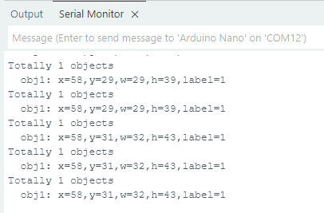
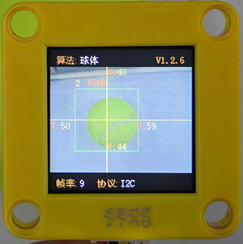
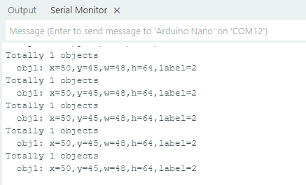
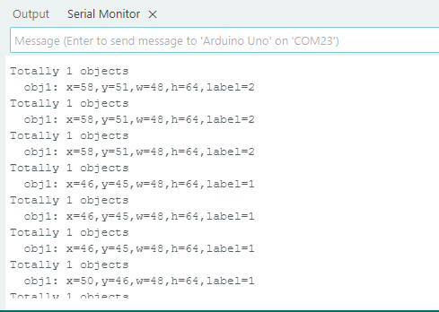

# 4.3 球体识别

## 4.3.1 算法简介


判断图像中是否有橙色乒乓球或者绿色网球，返回其坐标，大小及分类编号。

----------

## 4.3.2 分类标签

| 分类标签 |      含义      |
| :------: | :------------: |
|    1     | 乒乓球（橙色） |
|    2     |  网球（绿色）  |

乒乓球识别：



网球识别：



---------------

## 4.3.3 返回结果

主控器获取识别结果时，算法会返回以下数据：

|     参数     |      含义       |
| :----------: | :-------------: |
|   kXValue    | 标签中心横坐标x |
|   kYValue    | 标签中心纵坐标y |
| kWidthValue  |    标签宽度w    |
| kHeightValue |    标签高度h    |
|    kLabel    |    标签编号     |

代码：

```c
    // 遍历所有检测到的物体
    for (int i = 1; i <= obj_num; ++i) {
      // 获取每个物体的详细信息
      int x = sengo.GetValue(VISION_TYPE, kXValue, i);      // X 坐标
      int y = sengo.GetValue(VISION_TYPE, kYValue, i);      // Y 坐标
      int w = sengo.GetValue(VISION_TYPE, kWidthValue, i);  // 宽度
      int h = sengo.GetValue(VISION_TYPE, kHeightValue, i); // 高度
      int l = sengo.GetValue(VISION_TYPE, kLabel, i);       // 标签（物体类型）
      
      // 输出物体信息到串口
      Serial.print("  obj");
      Serial.print(i);
      Serial.print(": ");
      Serial.print("x=");
      Serial.print(x);
      Serial.print(",y=");
      Serial.print(y);
      Serial.print(",w=");
      Serial.print(w);
      Serial.print(",h=");
      Serial.print(h);
      Serial.print(",label=");
      Serial.println(l);
    }
```

----------

## 4.3.4 代码

```c
#include <Arduino.h>      // Arduino 核心库
#include <Sentry.h>       // Sengo 视觉传感器库

// 类型定义，将 Sengo1 类型重命名为 Sengo，方便后续使用
typedef Sengo1 Sengo;

// 通信接口选择（二选一）
#define SENGO_I2C         // 使用 I2C 通信
// #define SENGO_UART      // 使用 UART 通信（当前被注释掉）

// 根据选择的通信方式包含相应的库
#ifdef SENGO_I2C
#include <Wire.h>         // Arduino I2C 库
#endif

#ifdef SENGO_UART
#include <SoftwareSerial.h> // 软件串口库（用于非硬件串口）
#define TX_PIN 11         // 定义软件串口发送引脚
#define RX_PIN 10         // 定义软件串口接收引脚
SoftwareSerial mySerial(RX_PIN, TX_PIN); // 创建软件串口对象
#endif

// 定义视觉识别类型为球体检测
#define VISION_TYPE Sengo::kVisionBall
Sengo sengo;              // 创建 Sengo 传感器对象

// 初始化函数 - 在设备启动时运行一次
void setup() {
  sentry_err_t err = SENTRY_OK; // 定义错误变量，初始化为无错误

  // 初始化串口通信，用于与电脑通信输出调试信息
  Serial.begin(9600);
  Serial.println("Waiting for sengo initialize...");

  // 根据选择的通信方式初始化传感器
#ifdef SENGO_I2C
  Wire.begin();           // 初始化 I2C 总线
  // 尝试初始化传感器，直到成功为止
  while (SENTRY_OK != sengo.begin(&Wire)) { 
    yield();              // 在等待期间让出 CPU 时间，防止看门狗复位
  }
#endif  // SENGO_I2C

#ifdef SENGO_UART
  mySerial.begin(9600);   // 初始化软件串口
  // 尝试初始化传感器，直到成功为止
  while (SENTRY_OK != sengo.begin(&mySerial)) { 
    yield();
  }
#endif  // SENGO_UART

  Serial.println("Sengo begin Success."); // 传感器初始化成功

  // 设置视觉识别模式为球体检测
  err = sengo.VisionBegin(VISION_TYPE);
  Serial.print("sengo.VisionBegin(kVisionBall) ");
  
  // 检查设置是否成功并输出结果
  if (err) {
    Serial.print("Error: 0x");
  } else {
    Serial.print("Success: 0x");
  }
  Serial.println(err, HEX); // 以十六进制格式输出错误代码
}

// 主循环函数 - 在初始化后重复运行
void loop() {
  // 获取检测到的物体数量
  int obj_num = sengo.GetValue(VISION_TYPE, kStatus);
  
  // 如果检测到物体
  if (obj_num) {
    Serial.print("Totally ");
    Serial.print(obj_num);
    Serial.println(" objects");
    
    // 遍历所有检测到的物体
    for (int i = 1; i <= obj_num; ++i) {
      // 获取每个物体的详细信息
      int x = sengo.GetValue(VISION_TYPE, kXValue, i);      // X 坐标
      int y = sengo.GetValue(VISION_TYPE, kYValue, i);      // Y 坐标
      int w = sengo.GetValue(VISION_TYPE, kWidthValue, i);  // 宽度
      int h = sengo.GetValue(VISION_TYPE, kHeightValue, i); // 高度
      int l = sengo.GetValue(VISION_TYPE, kLabel, i);       // 标签（物体类型）
      
      // 输出物体信息到串口
      Serial.print("  obj");
      Serial.print(i);
      Serial.print(": ");
      Serial.print("x=");
      Serial.print(x);
      Serial.print(",y=");
      Serial.print(y);
      Serial.print(",w=");
      Serial.print(w);
      Serial.print(",h=");
      Serial.print(h);
      Serial.print(",label=");
      Serial.println(l);
    }
  }
  
}
```

-----------

## 4.3.5 代码结果

上传代码后，AI视觉模块将会对摄像头拍到的地方进行识别如果乒乓球（橙色）或网球（绿色）则会被他捕捉并识别，然后通过串口监视器进行打印标签在屏幕上显示的位置xy与宽度高度以及标签代表的值。




