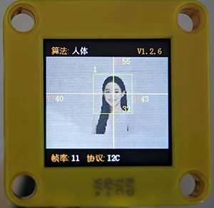
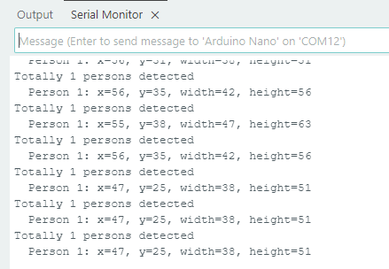

# 4.6 人体检测

## 4.6.1 算法简介



依据由头部肩部构成的人体上半身特征判断图像中是否有人，返回其坐标和大小。

---------------

## 4.6.2 返回数据

主控器获取识别结果时，算法会返回以下数据：

|     结果     |    含义     |
| :----------: | :---------: |
|   kXValue    | 中心横坐标x |
|   kYValue    | 中心纵坐标y |
| kWidthValue  |    宽度w    |
| kHeightValue |    高度h    |

代码：

```c
// 如果检测到人体
  if (obj_num) {
    Serial.print("Totally ");
    Serial.print(obj_num);
    Serial.println(" persons detected");
    
    // 遍历所有检测到的人体
    for (int i = 1; i <= obj_num; ++i) {
      // 获取每个人体的详细信息
      int x = sengo.GetValue(VISION_TYPE, kXValue, i);      // X 坐标（人体中心位置）
      int y = sengo.GetValue(VISION_TYPE, kYValue, i);      // Y 坐标（人体中心位置）
      int w = sengo.GetValue(VISION_TYPE, kWidthValue, i);  // 人体检测框宽度
      int h = sengo.GetValue(VISION_TYPE, kHeightValue, i); // 人体检测框高度
      
      // 输出人体信息到串口
      Serial.print("  Person ");
      Serial.print(i);
      Serial.print(": ");
      Serial.print("x=");
      Serial.print(x);
      Serial.print(", y=");
      Serial.print(y);
      Serial.print(", width=");
      Serial.print(w);
      Serial.print(", height=");
      Serial.print(h);
    }
```

----------

## 4.6.3使用技巧

1. 人正面朝向Sengo1时检测效果最佳，侧面与背面朝向时检测率会降低；
2. 背景简单，上身着装鲜艳且与背景颜色差异明显时检测效果最佳；

-------

## 4.6.4 代码

```c
#include <Arduino.h>      // Arduino 核心库
#include <Sentry.h>       // Sengo 视觉传感器库

// 类型定义，将 Sengo1 类型重命名为 Sengo，方便后续使用
typedef Sengo1 Sengo;

// 通信接口选择（二选一）
#define SENGO_I2C         // 使用 I2C 通信
// #define SENGO_UART      // 使用 UART 通信（当前被注释掉）

// 根据选择的通信方式包含相应的库
#ifdef SENGO_I2C
#include <Wire.h>         // Arduino I2C 库
#endif

#ifdef SENGO_UART
#include <SoftwareSerial.h> // 软件串口库（用于非硬件串口）
#define TX_PIN 11         // 定义软件串口发送引脚
#define RX_PIN 10         // 定义软件串口接收引脚
SoftwareSerial mySerial(RX_PIN, TX_PIN); // 创建软件串口对象
#endif

// 定义视觉识别类型为人体检测
#define VISION_TYPE Sengo::kVisionBody
Sengo sengo;              // 创建 Sengo 传感器对象

// 初始化函数 - 在设备启动时运行一次
void setup() {
  sentry_err_t err = SENTRY_OK; // 定义错误变量，初始化为无错误

  // 初始化串口通信，用于与电脑通信输出调试信息
  Serial.begin(9600);
  Serial.println("Waiting for sengo initialize...");

  // 根据选择的通信方式初始化传感器
#ifdef SENGO_I2C
  Wire.begin();           // 初始化 I2C 总线
  // 尝试初始化传感器，直到成功为止
  while (SENTRY_OK != sengo.begin(&Wire)) { 
    yield();              // 在等待期间让出 CPU 时间，防止看门狗复位
  }
#endif  // SENGO_I2C

#ifdef SENGO_UART
  mySerial.begin(9600);   // 初始化软件串口
  // 尝试初始化传感器，直到成功为止
  while (SENTRY_OK != sengo.begin(&mySerial)) { 
    yield();
  }
#endif  // SENGO_UART

  Serial.println("Sengo begin Success."); // 传感器初始化成功

  // 设置视觉识别模式为人体检测
  err = sengo.VisionBegin(VISION_TYPE);
  Serial.print("sengo.VisionBegin(kVisionBody) ");
  
  // 检查设置是否成功并输出结果
  if (err) {
    Serial.print("Error: 0x");
  } else {
    Serial.print("Success: 0x");
  }
  Serial.println(err, HEX); // 以十六进制格式输出错误代码
}

// 主循环函数 - 在初始化后重复运行
void loop() {
  // 获取检测到的人体数量
  int obj_num = sengo.GetValue(VISION_TYPE, kStatus);
  
  // 如果检测到人体
  if (obj_num) {
    Serial.print("Totally ");
    Serial.print(obj_num);
    Serial.println(" persons detected");
    
    // 遍历所有检测到的人体
    for (int i = 1; i <= obj_num; ++i) {
      // 获取每个人体的详细信息
      int x = sengo.GetValue(VISION_TYPE, kXValue, i);      // X 坐标（人体中心位置）
      int y = sengo.GetValue(VISION_TYPE, kYValue, i);      // Y 坐标（人体中心位置）
      int w = sengo.GetValue(VISION_TYPE, kWidthValue, i);  // 人体检测框宽度
      int h = sengo.GetValue(VISION_TYPE, kHeightValue, i); // 人体检测框高度
      
      // 输出人体信息到串口
      Serial.print("  Person ");
      Serial.print(i);
      Serial.print(": ");
      Serial.print("x=");
      Serial.print(x);
      Serial.print(", y=");
      Serial.print(y);
      Serial.print(", width=");
      Serial.print(w);
      Serial.print(", height=");
      Serial.println(h);
    }
  } 
}
```

-----------

## 4.6.5 代码结果

上传代码后，AI视觉模块将会对摄像头拍到的地方进行识别，如果有识别到人体将会在串口监视器中打印人体的坐标以及宽高。




