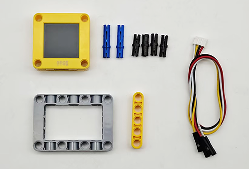
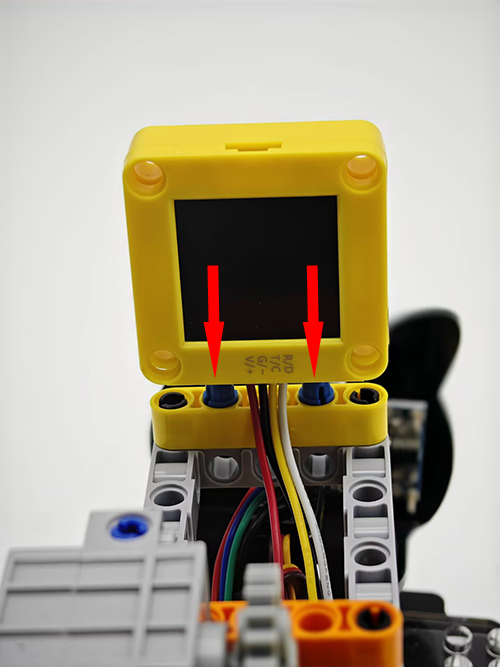
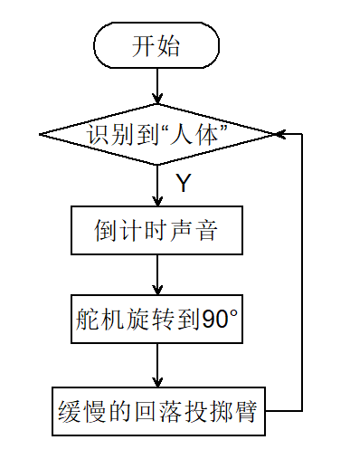

# 5.5 智能投石车

## 5.5.1 简介

使用AI视觉模块搭配小车的投石攻城车造型，制作出有趣的自动识别投石器，先将AI视觉模块固定到投石器小车上，然后使用AI模块进行识别如果识别到了人体就蜂鸣器开始倒计时3声然后投掷，投掷结束后缓慢落下投掷臂等待下一次识别到人体后投掷。

## 5.5.2 将AI模块安装到投石小车上

<p style="color:red;font-size:25px;">注意：你需要先按照小车教程将`投石攻城车`的乐高搭建好，然后再按照下方的安装教程进行安装。</p>

**所需配件**

  

**步骤1：**


**步骤2：**


**步骤3：**




**步骤4：**

|  AI视觉模块  | 小车接口 |
| :----------: | :------: |
| T/C (黄色线) |   SCL    |
| R/D (白色线) |   SDA    |
| V/+ (红色线) |    5V    |
| G/- (黑色线) |    G     |


**完整展示：**


## 5.5.3 流程图



## 5.5.4 代码

```c
#include <Arduino.h>  // Arduino 核心库
#include <Sentry.h>   // Sengo 视觉传感器库
//引入 Servo 舵机控制库
#include <Servo.h>

Servo servo;  //创建伺服对象以控制伺服系统

#define BUZZER_PIN 3  //蜂鸣器引脚

// 类型定义，将 Sengo1 类型重命名为 Sengo，方便后续使用
typedef Sengo1 Sengo;

// 通信接口选择（二选一）
#define SENGO_I2C  // 使用 I2C 通信
// #define SENGO_UART      // 使用 UART 通信（当前被注释掉）

// 根据选择的通信方式包含相应的库
#ifdef SENGO_I2C
#include <Wire.h>  // Arduino I2C 库
#endif

#ifdef SENGO_UART
#include <SoftwareSerial.h>               // 软件串口库（用于非硬件串口）
#define TX_PIN 11                         // 定义软件串口发送引脚
#define RX_PIN 10                         // 定义软件串口接收引脚
SoftwareSerial mySerial(RX_PIN, TX_PIN);  // 创建软件串口对象
#endif

// 定义视觉识别类型为人体检测
#define VISION_TYPE Sengo::kVisionBody
Sengo sengo;  // 创建 Sengo 传感器对象

// 初始化函数 - 在设备启动时运行一次
void setup() {
  sentry_err_t err = SENTRY_OK;  // 定义错误变量，初始化为无错误

  // 初始化串口通信，用于与电脑通信输出调试信息
  Serial.begin(9600);
  Serial.println("Waiting for sengo initialize...");

  // 根据选择的通信方式初始化传感器
#ifdef SENGO_I2C
  Wire.begin();  // 初始化 I2C 总线
  // 尝试初始化传感器，直到成功为止
  while (SENTRY_OK != sengo.begin(&Wire)) {
    yield();  // 在等待期间让出 CPU 时间，防止看门狗复位
  }
#endif  // SENGO_I2C

#ifdef SENGO_UART
  mySerial.begin(9600);  // 初始化软件串口
  // 尝试初始化传感器，直到成功为止
  while (SENTRY_OK != sengo.begin(&mySerial)) {
    yield();
  }
#endif  // SENGO_UART

  Serial.println("Sengo begin Success.");  // 传感器初始化成功

  // 设置视觉识别模式为人体检测
  err = sengo.VisionBegin(VISION_TYPE);
  Serial.print("sengo.VisionBegin(kVisionBody) ");

  // 检查设置是否成功并输出结果
  if (err) {
    Serial.print("Error: 0x");
  } else {
    Serial.print("Success: 0x");
  }
  Serial.println(err, HEX);  // 以十六进制格式输出错误代码
    //舵机角度初始化
  servo.attach(A0);
  servo.write(35);
  //设置引脚为输出模式
  pinMode(BUZZER_PIN, OUTPUT);
}

// 主循环函数 - 在初始化后重复运行
void loop() {
  // 获取检测到的人体数量
  int obj_num = sengo.GetValue(VISION_TYPE, kStatus);

  if (obj_num) {  // 如果检测到物体
    //投掷倒计时声音
    countdown(3);
    //投掷
    servo.write(90);
    delay(1000);
    //缓慢回落
    for (int j = 90; j > 35; j--) {
      servo.write(j);
      delay(15);
    }
    delay(500);
  }
}

void countdown(int seconds) {
  for (int i = seconds; i > 0; i--) {
    // 倒计时滴答声
    tone(BUZZER_PIN, 800, 100);
    delay(200);
    noTone(BUZZER_PIN);
    // 间隔时间
    delay(800);
  }
}
```

## 5.5.5 代码结果

上传代码成功后，AI视觉模块会开启“人体识别”模式然后对拍到的画面进行识别，判断是否有检测到人体，如果有则进行投掷，投掷前会有三声倒计时提示音倒计时结束就会进行投掷，投掷完成后投掷臂会慢慢的回落等待下一次投掷。这样就实现了一个防盗保护了。

