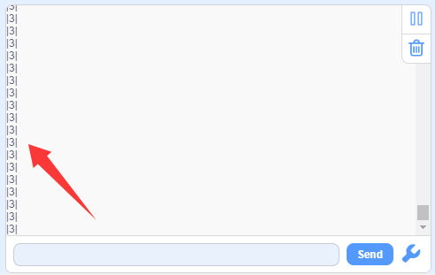
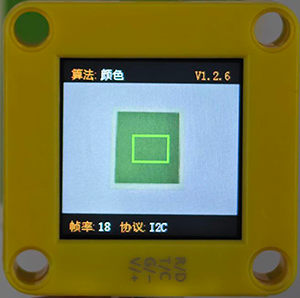
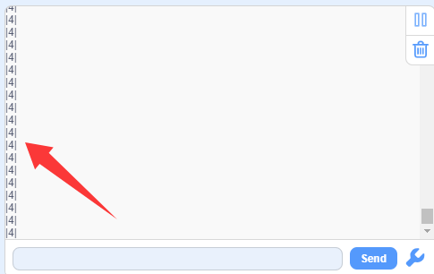
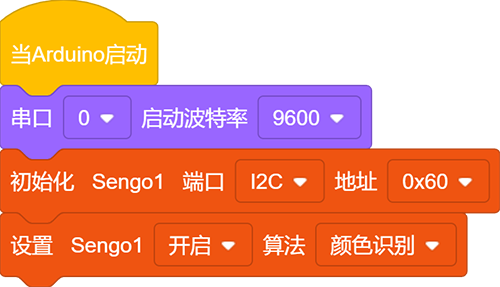
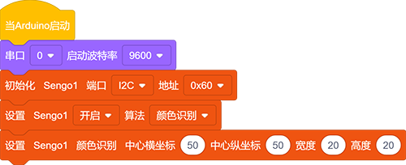
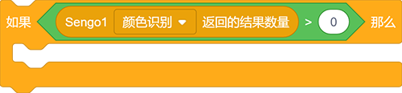
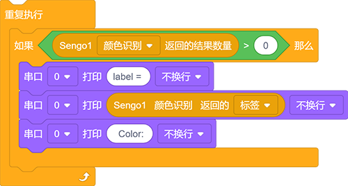
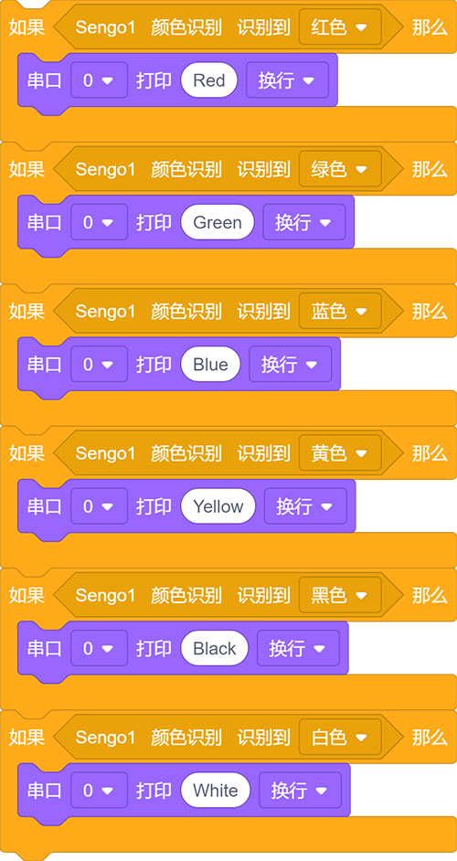
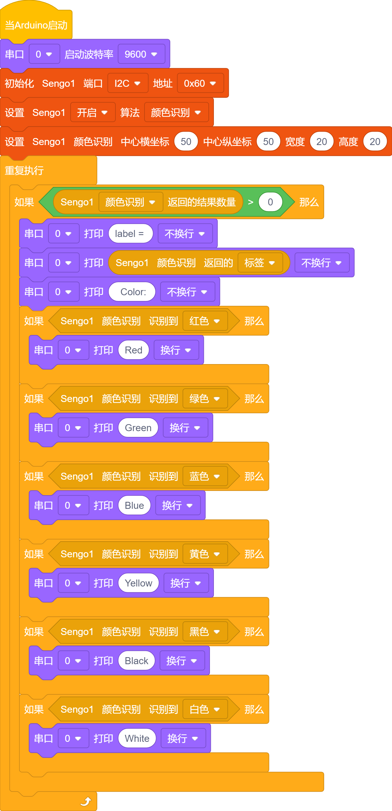
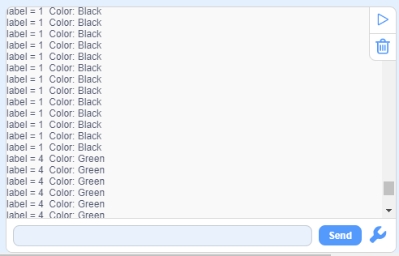

# 4.1 识别颜色

## 4.1.1 算法简介

指定一个识别区域，其位置和大小可根据需要进行设置，返回该区域的颜色标签以及红色分量值R、绿色分量值G与蓝色分量值B。

---------------------

## 4.1.2 颜色分类标签

Sengo1定义了7 种颜色的分类标签：

| 标签值 | 含义 | 标签值 | 含义 |
| :----: | :--: | :----: | :--: |
|   1    | 黑色 |   2    | 白色 |
|   3    | 红色 |   4    | 绿色 |
|   5    | 蓝色 |   6    | 黄色 |
|   0    | 未知 |        |      |

注：不在表格中的常见的颜色如紫色、青色（蓝绿色）、橙色、灰色等，其颜色区分度较低，容易误识别为表格中的颜色， 因此这几种颜色被归为未知颜色。如若需要识别以上颜色，可根据返回的RGB分量值自行进行判定。

示例1：

串口标签值输出为：（可以看到识别框输出的颜色标签值都为3，与表格中的标签值对应）

示例2：

串口标签值输出为：（输出的标签值也与表格对应）

-------------------------

## 4.1.3 代码块介绍

1. 块，用于设置Sengo1的通信方式的，点击`端口`后方可以选择`I2C`,`Serial`,`Serial2`
2. 块，用于设置运行AI视觉模块的功能代码，点击`算法`后方可以选择想要的功能：`颜色识别`,`色块检测`,`球体识别`,`线条检测`,`卡片识别`,`人体检测`,`人脸识别`,`二维码`
4. 块，用于设置识别区域坐标和识别框的大小，如未指定新的参数，则以默认值运行，参数定义如下：

|    参数    |        含义         | 默认值 |
| :--------: | :-----------------: | :----: |
| 中心横坐标 | 识别区域中心横坐标x |   50   |
| 中心纵坐标 | 识别区域中心纵坐标y |   50   |
|    宽度    |    识别区域宽度w    |   3    |
|    高度    |    识别区域高度h    |   4    |

5. 块，用于各个功能模式下返回AI视觉模块识别到的结果数量
6. 块，用于返回识别到的颜色标签值（对应`4.1.2 颜色分类标签`中的表)
7. 块，用于判断是否检测到设置好的颜色，如果有检测到则返回1，没有则返回0

--------------------

## 4.1.5 识别颜色算法使用技巧

1. 当识别区域较小时，譬如2x2，虽然识别速度快，但因像素点过少，结果易被干扰，其可信度较低，只适用于背景单一可控的应用场合；

2. 当识别区域较大时，譬如20x20，因像素点多，区域内杂色的干扰被会滤除，结果具有较高的可信度，但识别速度慢；

3. 当识别区域内不同颜色的面积相当时，结果可能会反复跳变；

-----------------------

## 4.1.6 代码

1. 在代码启动中设置串口波特率为`9600`，然后设置AI视觉模块的通信方式为`I2C`，再设置AI视觉模块运行`颜色识别`模式

2. 再设置AI视觉模块识别的参数，设置识别框位置X为50，Y为50，设置识别框大小宽为20，高为20

3. 使用判断模块对检测数量进行判断，只有检测数量大于0时才进行颜色标签值的输出

4. 先使用串口打印模块不换行打印字符`label = `，用串口打印模块不换行打印颜色的“label”值，再用串口打印模块不换行打印字符`  Color: `

5. 使用判断模块对识别到的颜色进行判断并使用串口打印模块将识别到的颜色打印出来

**完整代码：**

----------------

## 4.1.7 代码结果

上传代码后，AI视觉模块上将出现识别框并对框中的颜色进行识别，然后通过串口监视器打印识别到颜色对应的标签值与颜色名称。

