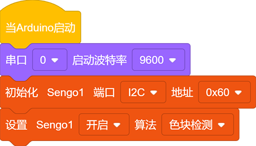
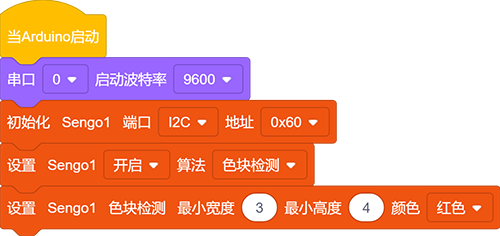
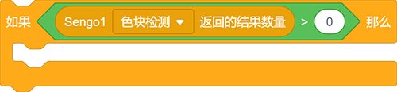
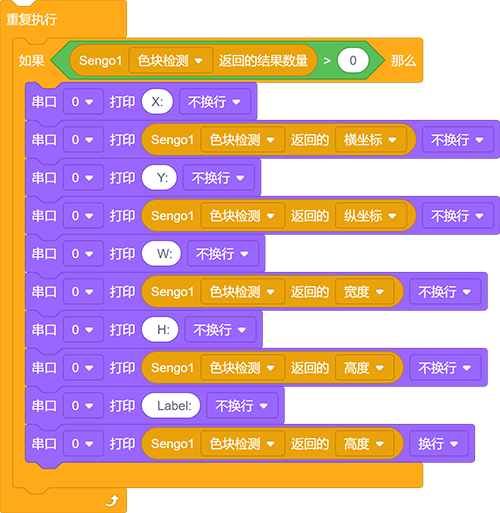
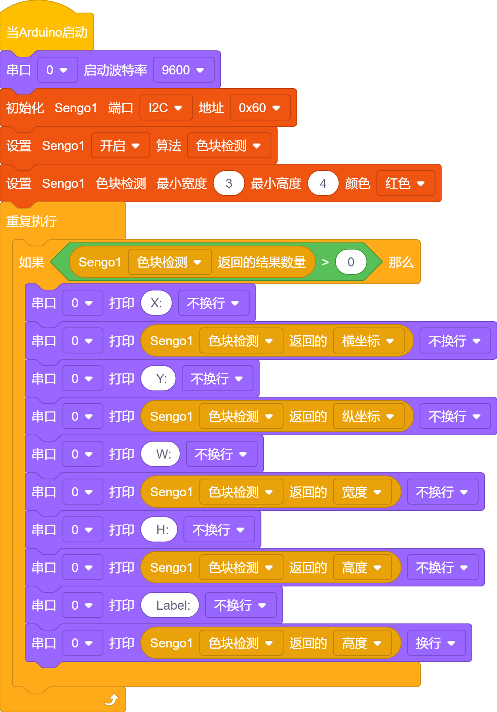
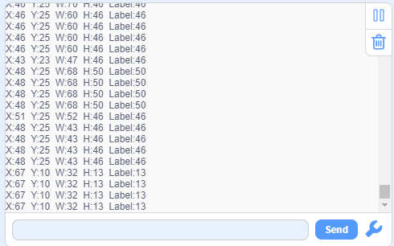

# 4.2 色块检测

## 4.2.1 算法简介

指定某种检测颜色，判断图像中是否有该颜色的色块，返回其坐标和大小，颜色分类标签与颜色识别中的定义相同。

颜色分类标签：

| 标签值 | 含义 | 标签值 | 含义 |
| :----: | :--: | :----: | :--: |
|   1    | 黑色 |   2    | 白色 |
|   3    | 红色 |   4    | 绿色 |
|   5    | 蓝色 |   6    | 黄色 |
|   0    | 未知 |        |      |

---------------------------

## 4.2.2 代码块介绍

1. 块，用于设置检测色块的最小识别尺寸与识别的颜色（注意：一次只能指定识别一种色块)

2. 块，使用时先设置当前功能（色块检测或球体识别卡片识别等...）然后设置返回检测到物体的现在再屏幕上的位置（y，z)以及大小（w，h)还有一个就是标签

|  形参  |      含义       |
| :----: | :-------------: |
| 横坐标 | 色块中心横坐标x |
| 纵坐标 | 色块中心纵坐标y |
|  宽度  |    色块宽度w    |
|  高度  |    色块高度h    |
|  标签  |  颜色分类标签   |

---------------------

## 4.2.3 代码

1. 在代码启动中设置串口波特率为`9600`，然后设置AI视觉模块的通信方式为`I2C`，再设置AI视觉模块运行`色块检测`模式。

2. 设置识别色块的尺寸最小值以及识别的颜色

3. 使用判断模块对检测数量进行判断，只有检测数量大于0时才进行色块数据的输出，注意选择的是`色块检测`。

4. 使用串口打印模块对识别到的色块的各项数据进行输出。

**完整代码：**

----------------------------

## 4.2.4 代码结果

上传代码后，AI视觉模块将会对摄像头拍到的地方进行分析如果有红色块就会进行框选标记，并且再串口监视器中打印色块在屏幕中的位置坐标xy与宽度高度还有颜色标签值。

