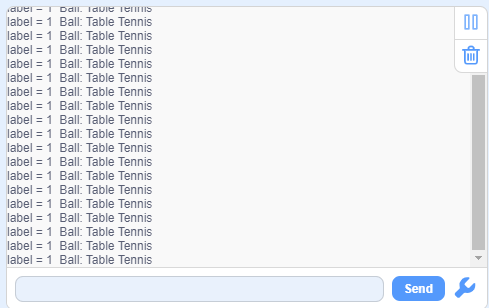
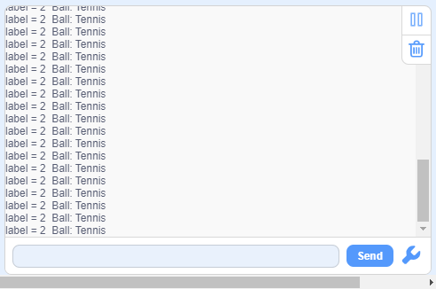
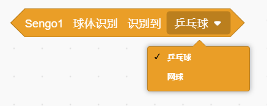
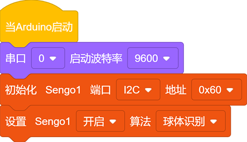
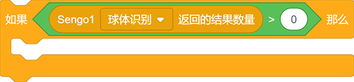
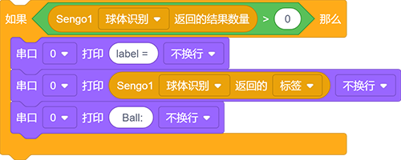
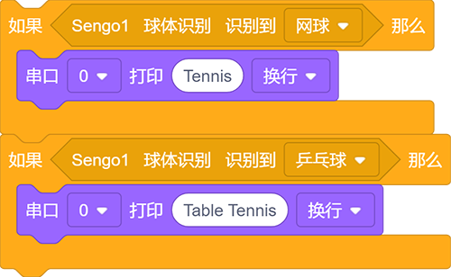
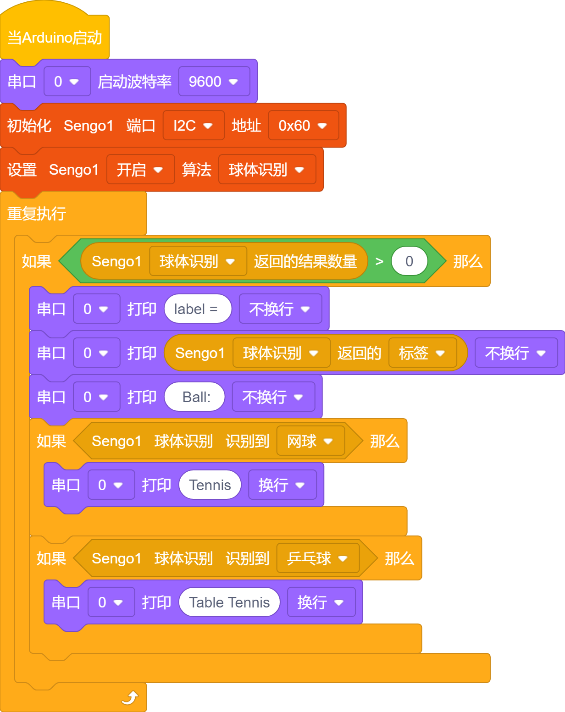
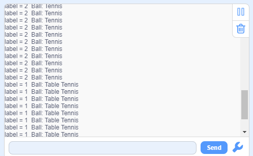

# 4.3 球体识别

## 4.3.1 算法简介

判断图像中是否有橙色乒乓球或者绿色网球，返回其坐标，大小及分类编号。

----------

## 4.3.2 分类标签

| 分类标签 |      含义      |
| :------: | :------------: |
|    1     | 乒乓球（橙色） |
|    2     |  网球（绿色）  |

乒乓球识别：

网球识别：

## 4.3.3 代码块介绍

1. 块，用于判断检测到的球体是'乒乓球' 还是 '网球'。

   

----------

## 4.3.4 代码

1. 在代码启动中设置串口波特率为`9600`，然后设置AI视觉模块的通信方式为`I2C`，再设置AI视觉模块运行`球体识别`模式

2. 使用判断模块对检测数量进行判断，只有检测数量大于0时才进行球体数据的输出，注意选择的是`球体识别`

3. 使用串口打样模块打印识别到球体的`label`值（注意串口打印是不换行打印）

4. 使用模块进行判断并再串口中打印对应球体的名称

**完整代码：**

-----------

## 4.3.5 代码结果

上传代码后，AI视觉模块将会对摄像头拍到的地方进行识别如果乒乓球（橙色）或网球（绿色）则会被他捕捉并识别，然后通过串口监视器进行打印标签值与球体名称。

