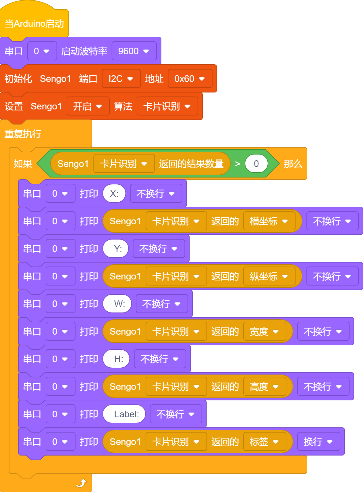

# 4.5 卡片识别

## 4.5.1 算法简介

识别图像中是否有配套的交通卡片，返回卡片的坐标、大小、分类标签等信息。

--------

## 4.5.2 卡片分类标签

| 分类标签 | 含义 |          图片           |
| :------: | :--: | :---------------------: |
|    1     | 前进 |  |
|    2     | 左转 |  |
|    3     | 右转 |  |
|    4     | 掉头 |  |
|    5     | 停车 |  |

注意：算法只支持单张卡片的识别。在一定的旋转角、偏转角与俯仰角内卡片仍然可以被识别，使用时请尽量正对卡片以期获得较好的识别效果。

------------

## 4.5.3 代码

1. 在代码启动中设置串口波特率为`9600`，然后设置AI视觉模块的通信方式为`I2C`，再设置AI视觉模块运行`卡片识别`模式

2. 使用判断模块对检测数量进行判断，只有检测数量大于0时才进行线条数据的输出，注意选择的是`卡片识别` ；通过串口打印模块对识别到的卡片数据进行打印。

**完整代码：**

## 4.5.4 代码结果

上传代码后，AI视觉模块将会对摄像头拍到的地方进行分析如果有卡片就会进行识别，并且在串口监视器中打印卡片的x，y坐标与宽度(w)，高度（h）以及卡片的标签值。

