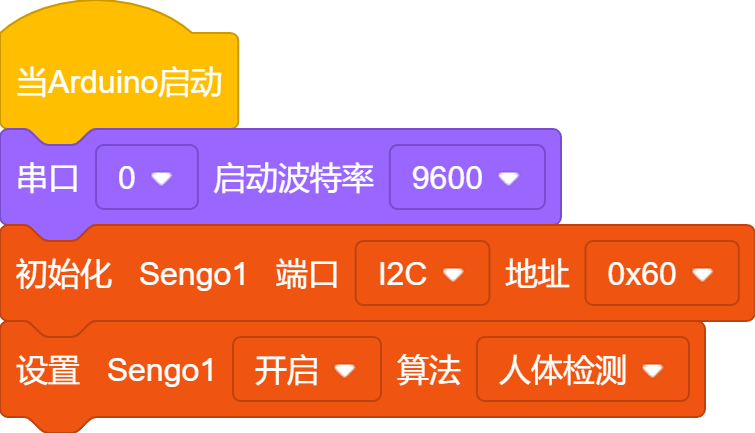
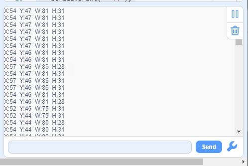

# 4.6 人体识别

## 4.6.1 算法简介

依据由头部肩部构成的人体上半身特征判断图像中是否有人，返回其坐标和大小。

## 4.6.2 返回数据

主控器获取识别结果时，算法会返回以下数据：

|  结果  |    含义     |
| :----: | :---------: |
| 横坐标 | 中心横坐标x |
| 纵坐标 | 中心纵坐标y |
|  宽度  |    宽度w    |
|  高度  |    高度h    |

----------

## 4.6.3 使用技巧

1. 人正面朝向Sengo1时检测效果最佳，侧面与背面朝向时检测率会降低；
2. 背景简单，上身着装鲜艳且与背景颜色差异明显时检测效果最佳；

-------

## 4.6.4 代码

1. 在代码启动中设置串口波特率为`9600`，然后设置AI视觉模块的通信方式为`I2C`，再设置AI视觉模块运行`人体检测`模式

2. 使用判断模块对检测数量进行判断，只有检测数量大于0时才用串口打印模块进行人体数据的输出，注意选择的是`人体检测`

**完整代码：**

-----------

## 4.6.5 代码结果

上传代码后，AI视觉模块将会对摄像头拍到的地方进行识别，如果有识别到人体将会在串口监视器中打印人体的坐标以及宽高。

