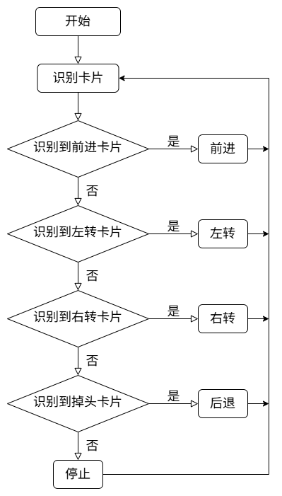
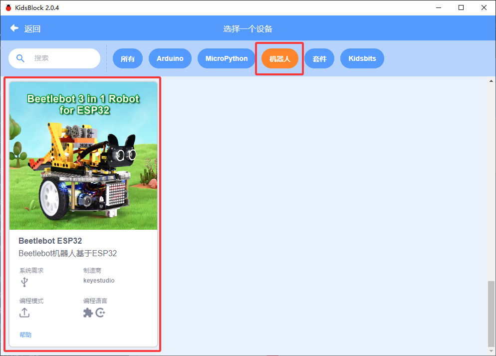
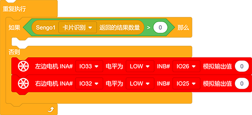
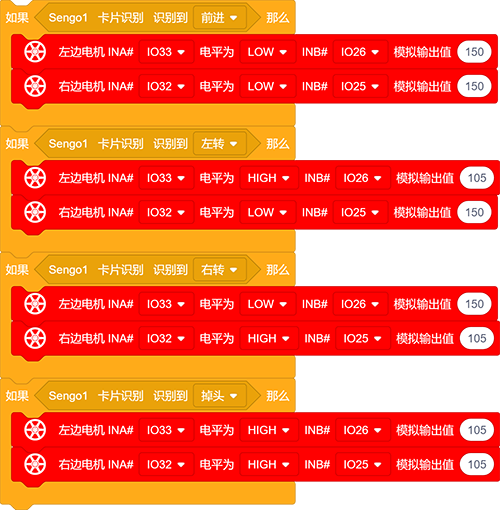
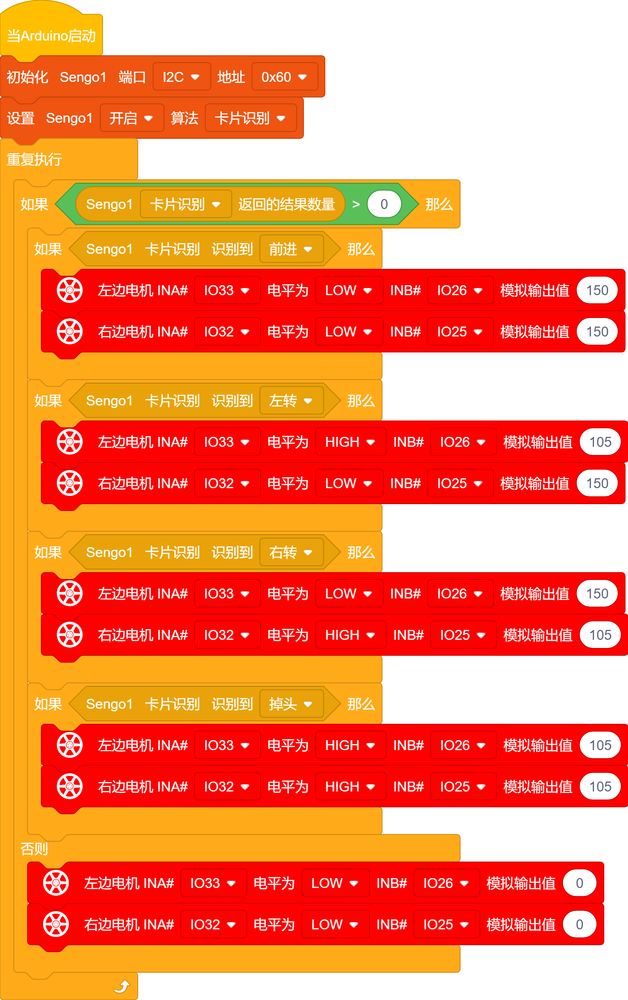

# 5.2 交通卡片控制小车

## 5.2.1 简介

交通卡片控制小车，卡片有前进，左转，右转，掉头，停止，AI视觉模块进行识别交通卡片，通过对应的卡片使小车进行相应的动作。

## 5.2.2 流程图

## 5.2.3 代码

如果你选择自己搭建代码，请选择小车的专用开发模块，因为我们要使用AI视觉模块与小车进行互动就会用到小车功能模块代码，添加小车专业的开发模块就能直接使用无需再次添加了。

1.在代码启动中添加设置AI视觉模块的通信方式为`I2C`，再设置AI视觉模块运行`卡片识别`模式

2.使用判断模块对检测数量进行判断，只有检测数量大于0时才进行数据的读取，注意功能选择的是`卡片识别`；在“否则”下方添加小车停止的代码

3.使用模块跟判断模块对读取到的卡片类型进行判断，满足判断模块的条件就执行下方的代码。

**完整代码：**

## 5.2.4 代码结果

上传代码成功后，AI视觉模块会对拍到的画面进行识别，判断是否有交通卡片，如果有则对卡片进行判断，卡片是`Forward`则小车前进，卡片是`Left`则小车左转 ，卡片是`Right`则小车右转 ，卡片是`Turn around`则小车后退 。

