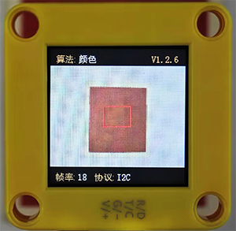
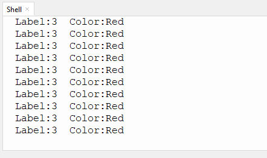
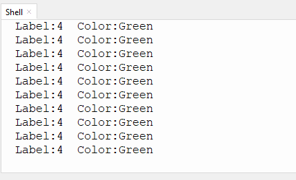

# 4.1 识别颜色

## 4.1.1 算法简介



指定一个识别区域，其位置和大小可根据需要进行设置，返回该区域的颜色标签以及红色分量值R、绿色分量值G与蓝色分量值B。

---------------------

## 4.1.2 颜色分类标签

Sengo1定义了7 种颜色的分类标签：

|      标签值      | 含义 |      标签值       | 含义 |
| :--------------: | :--: | :---------------: | :--: |
| 1（kColorBlack） | 黑色 | 2（kColorWhite）  | 白色 |
|  3（kColorRed）  | 红色 | 4（kColorGreen）  | 绿色 |
| 5（kColorBlue）  | 蓝色 | 6（kColorYellow） | 黄色 |

<span style="color:red;font-size:20px;">注：不在表格中的常见的颜色如紫色、青色（蓝绿色）、橙色、灰色等，其颜色区分度较低，容易误识别为表格中的颜色。如若需要识别以上颜色，可根据返回的RGB分量值自行进行判定。</span>

示例1：


串口标签值输出为：



示例2：


串口标签值输出为：



-------------------------

## 4.1.3 配置参数

用户可指定识别区域坐标和识别框的大小，参数定义如下：

|  参数  |        含义         |
| :----: | :-----------------: |
| 1（x） | 识别区域中心横坐标x |
| 2（y） | 识别区域中心纵坐标y |
| 3（w） |    识别区域宽度w    |
| 4（h） |    识别区域高度h    |
|   5    |         无          |

代码：`sengo1.SetParam(sengo1_vision_e.kVisionColor,[x, y, w, h, 1])`

```python
# 3、Sengo1图像的长宽比为4:3，当宽高值设为3:4时，识别区域为正方形；当宽高值设为1:1时，识别区域为长方形
sengo1.SetParam(sengo1_vision_e.kVisionColor,[50, 50, 3, 4, 1])
```

---------------

## 4.1.4 返回数据

主控器获取检测结果时，算法会返回以下数据：

|  形参   |          含义          |
| :-----: | :--------------------: |
| kRValue | 红色分量值R，范围0-255 |
| kGValue | 绿色分量值G，范围0-255 |
| kBValue | 蓝色分量值B，范围0-255 |
| kLabel  |      颜色分类标签      |

代码：

```python
        #读取颜色标签值
        label = sengo1.GetValue(sengo1_vision_e.kVisionColor,sentry_obj_info_e.kLabel)
```

--------------------

## 4.1.6 识别颜色算法使用技巧

1. 当识别区域较小时，譬如2x2，虽然识别速度快，但因像素点过少，结果易被干扰，其可信度较低，只适用于背景单一可控的应用场合；

2. 当识别区域较大时，譬如20x20，因像素点多，区域内杂色的干扰被会滤除，结果具有较高的可信度，但识别速度慢；

3. 当识别区域内不同颜色的面积相当时，结果可能会反复跳变；

-----------------------

## 4.1.7 代码

```python
from machine import I2C,UART,Pin
from  Sengo1  import *
import time
import random

color_Name = [" ","Black","Whiet","Red","Green","Blue","Yellow"]

# 等待Sengo1完成操作系统的初始化。此等待时间不可去掉，避免出现Sengo1尚未初始化完毕主控器已经开发发送指令的情况
time.sleep(3)

# 选择UART或者I2C通讯模式，Sengo1出厂默认为I2C模式，短按模式按键可以切换
# 4种UART通讯模式：UART9600（标准协议指令），UART57600（标准协议指令），UART115200（标准协议指令），Simple9600（简单协议指令），
# port = UART(2,rx=Pin(16),tx=Pin(17),baudrate=9600)
port = I2C(0,scl=Pin(21),sda=Pin(20),freq=400000)

# Sengo1通讯地址：0x60。如果I2C总线挂接多个设备，请避免出现地址冲突
sengo1 = Sengo1(0x60)


err = sengo1.begin(port)
if err != SENTRY_OK:
    print(f"Initialization failed，error code:{err}")
else:
    print("Initialization succeeded")

# 1、算法的默认参数设置，如无需更改参数，则可移除本代码块；
# 2、只有颜色识别与色块检测两种算法需要设置参数；
# 3、Sengo1图像的长宽比为4:3，当宽高值设为3:4时，识别区域为正方形；当宽高值设为1:1时，识别区域为长方形
sengo1.SetParam(sengo1_vision_e.kVisionColor,[50, 50, 3, 4, 1])
time.sleep(0.1)

#Sengo1每次只能运行一种识别算法；
err = sengo1.VisionBegin(sengo1_vision_e.kVisionColor)
if err != SENTRY_OK:
    print(f"Starting algo Color failed，error code:{err}")
else:
    print("Starting algo Color succeeded")

       
while True:   
    # Sengo1不主动返回检测识别结果，需要主控板发送指令进行读取。读取的流程：首先读取识别结果的数量，接收到指令后，Sengo1会刷新结果数据，如果结果数量不为零，那么主控再发送指令读取结果的相关信息。请务必按此流程构建程序。
    # Sengo最多输出1个识别结果。
    obj_num = (sengo1.GetValue(sengo1_vision_e.kVisionColor, sentry_obj_info_e.kStatus))
    if obj_num:
        #读取颜色标签值
        label = sengo1.GetValue(sengo1_vision_e.kVisionColor,sentry_obj_info_e.kLabel)
        #输出标签值与颜色名称
        print(f"Label:{label}  Color:{color_Name[label]}")
        time.sleep(0.2)

```

----------------

## 4.1.8 代码结果

上传代码后，AI视觉模块上将识别框对准要识别的颜色，识别框便会变成与要识别的颜色一样的颜色，然后通过串口监视器打印识别到颜色的标签值与名称。


