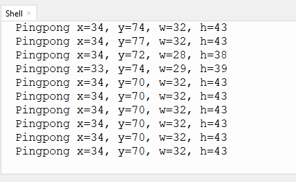
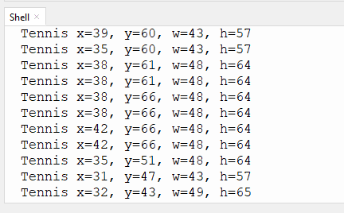

# 4.3 球体识别

## 4.3.1 算法简介


判断图像中是否有橙色乒乓球或者绿色网球，返回其坐标，大小及分类编号。

----------

## 4.3.2 分类标签

| 分类标签 |      含义      |
| :------: | :------------: |
|    1     | 乒乓球（橙色） |
|    2     |  网球（绿色）  |

乒乓球识别：



网球识别：



---------------

## 4.3.3 返回结果

当通过主控读取寄存器时，将会返回以下的数据：

|     参数     |      含义       |
| :----------: | :-------------: |
|   kXValue    | 标签中心横坐标x |
|   kYValue    | 标签中心纵坐标y |
| kWidthValue  |    标签宽度w    |
| kHeightValue |    标签高度h    |
|    kLabel    |    标签编号     |

代码：

```python
        #读取球体坐标x
        x = sengo1.GetValue(sengo1_vision_e.kVisionBall, sentry_obj_info_e.kXValue)
        #读取球体坐标y
        y = sengo1.GetValue(sengo1_vision_e.kVisionBall, sentry_obj_info_e.kYValue)
        #读取球体尺寸w
        w = sengo1.GetValue(sengo1_vision_e.kVisionBall, sentry_obj_info_e.kWidthValue)
        #读取球体尺寸h
        h = sengo1.GetValue(sengo1_vision_e.kVisionBall, sentry_obj_info_e.kHeightValue)
        
        # 利用获取到的结果的分类标签判断是否为乒乓球
        if ((sengo1.GetValue(sengo1_vision_e.kVisionBall,sentry_obj_info_e.kLabel)) == 1):
          print("Pingpong",end='')
        # 利用专用结果分类判定函数判断是否为网球
        if (sengo1.GetValue(sengo1_vision_e.kVisionBall,sentry_obj_info_e.kLabel)==ball_label_e.kBallTennis):
          print("Tennis",end='')
```

--------------

## 4.3.4 代码

```python
from machine import I2C,UART,Pin
from  Sengo1  import *
import time

# 等待Sengo1完成操作系统的初始化。此等待时间不可去掉，避免出现Sengo1尚未初始化完毕主控器已经开发发送指令的情况
time.sleep(2)

# 选择UART或者I2C通讯模式，Sengo1出厂默认为I2C模式，短按模式按键可以切换
# 4种UART通讯模式：UART9600（标准协议指令），UART57600（标准协议指令），UART115200（标准协议指令），Simple9600（简单协议指令），
# 参看“简单协议指令”
# port = UART(2,rx=Pin(16),tx=Pin(17),baudrate=9600)
port = I2C(0,scl=Pin(21),sda=Pin(20),freq=400000)

# Sengo1通讯地址：0x60。如果I2C总线挂接多个设备，请避免出现地址冲突
sengo1 = Sengo1(0x60)


err = sengo1.begin(port)
if err != SENTRY_OK:
    print(f"Initialization failed，error code:{err}")
else:
    print("Initialization succeeded")


#正常使用时，应由主控板通过指令控制Sengo1算法的开启与关闭，而不是通过Sengo1的按键进行操作；
err = sengo1.VisionBegin(sengo1_vision_e.kVisionBall)
if err != SENTRY_OK:
    print(f"Starting algo Ball failed，error code:{err}")
else:
    print("Starting algo Ball succeeded")


while True:
    # Sengo1不主动返回检测识别结果，需要主控板发送指令进行读取。读取的流程：首先读取识别结果的数量，接收到指令后，Sengo1会刷新结果数据，如果结果数量不为零，那么主控再发送指令读取结果的相关信息。请务必按此流程构建程序。
    obj_num = sengo1.GetValue(sengo1_vision_e.kVisionBall, sentry_obj_info_e.kStatus)
    if obj_num:
        #读取球体坐标x
        x = sengo1.GetValue(sengo1_vision_e.kVisionBall, sentry_obj_info_e.kXValue)
        #读取球体坐标y
        y = sengo1.GetValue(sengo1_vision_e.kVisionBall, sentry_obj_info_e.kYValue)
        #读取球体尺寸w
        w = sengo1.GetValue(sengo1_vision_e.kVisionBall, sentry_obj_info_e.kWidthValue)
        #读取球体尺寸h
        h = sengo1.GetValue(sengo1_vision_e.kVisionBall, sentry_obj_info_e.kHeightValue)
        
        # 利用获取到的结果的分类标签判断是否为乒乓球
        if ((sengo1.GetValue(sengo1_vision_e.kVisionBall,sentry_obj_info_e.kLabel)) == 1):
          print("Pingpong",end='')
        # 利用专用结果分类判定函数判断是否为网球
        if (sengo1.GetValue(sengo1_vision_e.kVisionBall,sentry_obj_info_e.kLabel)==ball_label_e.kBallTennis):
          print("Tennis",end='')
          
        print(" x=%d, y=%d, w=%d, h=%d"%(x, y, w, h))
        time.sleep(0.2)   


```

-----------

## 4.3.5 代码结果

上传代码后，AI视觉模块将会对摄像头拍到的地方进行识别如果乒乓球（橙色）或网球（绿色）则会被他捕捉并识别，然后通过串口监视器进行打印标签在屏幕上显示的球体名称以及位置xy与宽度高度。


