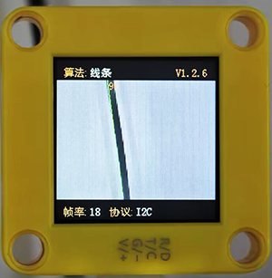
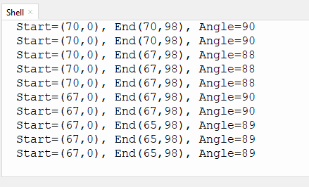

# 4.4 线条检测

## 4.4.1 算法简介



判断图像中是否有线段，如果有则会返回线段两个端点的坐标以及倾斜角度，如果线段为曲线，则返回由起点与终点相连所形成的直线的角度。

---------------

## 4.4.2 返回数据

主控器获取识别结果时，算法会返回以下数据：

|     参数     |          含义           |
| :----------: | :---------------------: |
|   kXValue    | 线段终点（远端）横坐标x |
|   kYValue    | 线段终点（远端）纵坐标y |
| kWidthValue  | 线段起点（近端）横坐标x |
| kHeightValue | 线段起点（近端）纵坐标y |
|    kLabel    |     线段的倾斜角度      |

<span style="color:red;font-size:20px;">注意：倾斜角逆时针增大，线段水平向右时其倾斜角为0°，线段垂直向上时其倾斜角为90°，线段水平向左时其倾斜角为 180°。算法不会向下检测输出角度。</span>

代码：

```python
     #获取线条角度
     angle = sengo1.GetValue(sengo1_vision_e.kVisionLine,sentry_obj_info_e.kLabel)
     #获取线条起始端x1
     x1 = sengo1.GetValue(sengo1_vision_e.kVisionLine,sentry_obj_info_e.kXValue)
     #获取线条起始端y1
     y1 = sengo1.GetValue(sengo1_vision_e.kVisionLine,sentry_obj_info_e.kYValue)
     #获取线条结束端x2
     x2 = sengo1.GetValue(sengo1_vision_e.kVisionLine,sentry_obj_info_e.kWidthValue)
     #获取线条结束端y2
     y2 = sengo1.GetValue(sengo1_vision_e.kVisionLine,sentry_obj_info_e.kHeightValue)
     #打印线条数据
     print("Start=(%d,%d), End(%d,%d), Angle=%d"%(x1,y1,x2,y2,angle))
```

---------------

## 4.4.3 使用技巧

1. 请勿使用表面光滑的地图，避免反光导致检测失败；
2. 背景与线条边界应清晰分明，颜色差异明显，譬如白底黑线；
3. 背景尽量简单，颜色单一；如果背景杂乱，则可能会检测背景中的线条；
4. 线条粗细应适中，过细或过宽均影响检测；
5. 巡线时，第一条线段始终为屏幕下方最先检测到的线段；

--------------

## 4.4.4 代码

```python
from machine import I2C,UART,Pin
from  Sengo1  import *
import time

# 等待Sengo1完成操作系统的初始化。此等待时间不可去掉，避免出现Sengo1尚未初始化完毕主控器已经开发发送指令的情况
time.sleep(3)

# 选择UART或者I2C通讯模式，Sengo1出厂默认为I2C模式，短按模式按键可以切换
# 4种UART通讯模式：UART9600（标准协议指令），UART57600（标准协议指令），UART115200（标准协议指令），Simple9600（简单协议指令），
# port = UART(2,rx=Pin(16),tx=Pin(17),baudrate=9600)
port = I2C(0,scl=Pin(21),sda=Pin(20),freq=400000)

# Sengo1通讯地址：0x60。如果I2C总线挂接多个设备，请避免出现地址冲突
sengo1 = Sengo1(0x60)

err = sengo1.begin(port)
if err != SENTRY_OK:
    print(f"Initialization failed，error code:{err}")
else:
    print("Initialization succeeded")

# 正常使用时，应由主控板通过指令控制Sengo1算法的开启与关闭，而不是通过Sengo1的按键进行操作；
err = sengo1.VisionBegin(sengo1_vision_e.kVisionLine)
if err != SENTRY_OK:
    print(f"Starting algo Line failed，error code:{err}")
else:
    print("Starting algo Line succeeded")

while True:
  obj_num = sengo1.GetValue(sengo1_vision_e.kVisionLine, sentry_obj_info_e.kStatus)
  # Sengo1不主动返回检测识别结果，需要主控板发送指令进行读取。读取的流程：首先读取识别结果的数量，接收到指令后，Sengo1会刷新结果数据，如果结果数量不为零，那么主控再发送指令读取结果的相关信息。请务必按此流程构建程序。
  # Sengo最多输出1个识别结果。
  if obj_num:
     #获取线条角度
     angle = sengo1.GetValue(sengo1_vision_e.kVisionLine,sentry_obj_info_e.kLabel)
     #获取线条起始端x1
     x1 = sengo1.GetValue(sengo1_vision_e.kVisionLine,sentry_obj_info_e.kXValue)
     #获取线条起始端y1
     y1 = sengo1.GetValue(sengo1_vision_e.kVisionLine,sentry_obj_info_e.kYValue)
     #获取线条结束端x2
     x2 = sengo1.GetValue(sengo1_vision_e.kVisionLine,sentry_obj_info_e.kWidthValue)
     #获取线条结束端y2
     y2 = sengo1.GetValue(sengo1_vision_e.kVisionLine,sentry_obj_info_e.kHeightValue)
     #打印线条数据
     print("Start=(%d,%d), End(%d,%d), Angle=%d"%(x1,y1,x2,y2,angle))


```

--------------------

## 4.4.5 代码结果

上传代码后，AI视觉模块将会对摄像头拍到的地方进行分析如果有线条就会进行识别，并且在串口监视器中打印线条的起始和结束坐标以及角度（角度的判别是垂直线是90度，水平垂直线是180度）。




