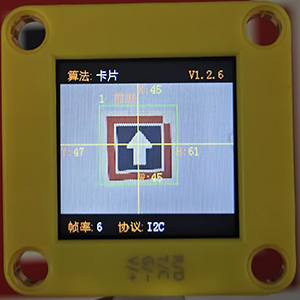
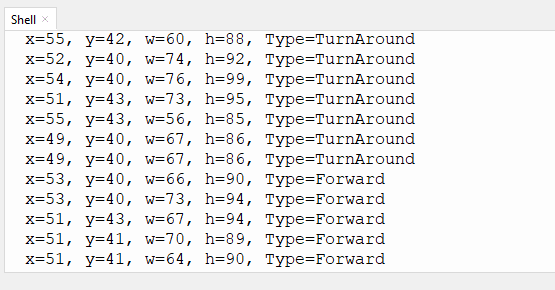

# 4.5 卡片识别

## 4.5.1 算法简介



识别图像中是否有配套的交通卡片，返回卡片的坐标、大小、分类标签等信息。

--------

## 4.5.2 卡片分类标签

| 分类标签 | 含义 |          图片           |
| :------: | :--: | :---------------------: |
|    1     | 前进 |  |
|    2     | 左转 |  |
|    3     | 右转 |  |
|    4     | 掉头 |  |
|    5     | 停车 |  |

注意：算法只支持单张卡片的识别。在一定的旋转角、偏转角与俯仰角内卡片仍然可以被识别，使用时请尽量正对卡片以期获得较好的识别效果。

----------------------

## 4.5.3 返回数据

主控器获取识别结果时，算法会返回以下数据：

|     参数     |      含义       |
| :----------: | :-------------: |
|   kXValue    | 卡片中心横坐标x |
|   kYValue    | 卡片中心纵坐标y |
| kWidthValue  |    卡片宽度w    |
| kHeightValue |    卡片高度h    |
|    kLabel    |  卡片分类标签   |

代码：

```python
        #读取卡片坐标x
        x = sengo1.GetValue(sengo1_vision_e.kVisionCard, sentry_obj_info_e.kXValue)
        #读取卡片坐标y
        y = sengo1.GetValue(sengo1_vision_e.kVisionCard, sentry_obj_info_e.kYValue)
        #读取卡片尺寸w
        w = sengo1.GetValue(sengo1_vision_e.kVisionCard, sentry_obj_info_e.kWidthValue)
        #读取卡片尺寸h
        h = sengo1.GetValue(sengo1_vision_e.kVisionCard, sentry_obj_info_e.kHeightValue)
        
        #获取卡片标签值
        cardType = sengo1.GetValue(sengo1_vision_e.kVisionCard,sentry_obj_info_e.kLabel)      
```

------------

## 4.5.4 代码

```python
from machine import I2C,UART,Pin
from  Sengo1  import *
import time
import random

# 等待Sengo1完成操作系统的初始化。此等待时间不可去掉，避免出现Sengo1尚未初始化完毕主控器已经开发发送指令的情况
time.sleep(3)

# 选择UART或者I2C通讯模式，Sengo1出厂默认为I2C模式，短按模式按键可以切换
# 4种UART通讯模式：UART9600（标准协议指令），UART57600（标准协议指令），UART115200（标准协议指令），Simple9600（简单协议指令），
#########################################################################################################
# port = UART(2,rx=Pin(16),tx=Pin(17),baudrate=9600)
port = I2C(0,scl=Pin(21),sda=Pin(20),freq=400000)

# Sengo1通讯地址：0x60。如果I2C总线挂接多个设备，请避免出现地址冲突
sengo1 = Sengo1(0x60)


err = sengo1.begin(port)
if err != SENTRY_OK:
    print(f"Initialization failed，error code:{err}")
else:
    print("Initialization succeeded")
 
 
err = sengo1.VisionBegin(sengo1_vision_e.kVisionCard)
if err != SENTRY_OK:
    print(f"Starting algo Card failed，error code:{err}")
else:
    print("Starting algo Card succeeded")
    

#卡片名称，从1开始到5都是对应卡片标签值
cardName = ["unknown","Forward","Left","Right","TurnAround","Park"]

while True:
    # Sengo1不主动返回检测识别结果，需要主控板发送指令进行读取。读取的流程：首先读取识别结果的数量，接收到指令后，Sengo1会刷新结果数据，如果结果数量不为零，那么主控再发送指令读取结果的相关信息。请务必按此流程构建程序。
    obj_num = sengo1.GetValue(sengo1_vision_e.kVisionCard, sentry_obj_info_e.kStatus)
    if obj_num:
        #读取卡片坐标x
        x = sengo1.GetValue(sengo1_vision_e.kVisionCard, sentry_obj_info_e.kXValue)
        #读取卡片坐标y
        y = sengo1.GetValue(sengo1_vision_e.kVisionCard, sentry_obj_info_e.kYValue)
        #读取卡片尺寸w
        w = sengo1.GetValue(sengo1_vision_e.kVisionCard, sentry_obj_info_e.kWidthValue)
        #读取卡片尺寸h
        h = sengo1.GetValue(sengo1_vision_e.kVisionCard, sentry_obj_info_e.kHeightValue)
        
        #获取卡片标签值
        cardType = sengo1.GetValue(sengo1_vision_e.kVisionCard,sentry_obj_info_e.kLabel)      
        print("x=%d, y=%d, w=%d, h=%d, Type=%s"%(x, y, w, h,cardName[cardType]))
        time.sleep(0.2)        
    
```

## 4.5.5 代码结果

上传代码后，AI视觉模块将会对摄像头拍到的地方进行分析如果有卡片就会进行识别，并且在串口监视器中打印卡片的位置尺寸与类型（前进，掉头，左转，右转等...）。



