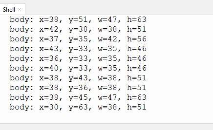

# 4.6 人体检测

## 4.6.1 算法简介


依据由头部肩部构成的人体上半身特征判断图像中是否有人，返回其坐标和大小。

---------------

## 4.6.2 返回数据

主控器获取识别结果时，算法会返回以下数据：

|     结果     |    含义     |
| :----------: | :---------: |
|   kXValue    | 中心横坐标x |
|   kYValue    | 中心纵坐标y |
| kWidthValue  |    宽度w    |
| kHeightValue |    高度h    |

代码：

```python
        #获取人体在显示屏上的x坐标
        x = sengo1.GetValue(sengo1_vision_e.kVisionBody, sentry_obj_info_e.kXValue)
        #获取人体在显示屏上的y坐标
        y = sengo1.GetValue(sengo1_vision_e.kVisionBody, sentry_obj_info_e.kYValue)
        #获取人体在显示屏上的宽
        w = sengo1.GetValue(sengo1_vision_e.kVisionBody, sentry_obj_info_e.kWidthValue)
        #获取人体在显示屏上的高
        h = sengo1.GetValue(sengo1_vision_e.kVisionBody, sentry_obj_info_e.kHeightValue)
```

----------

## 4.6.3使用技巧

1. 人正面朝向Sengo1时检测效果最佳，侧面与背面朝向时检测率会降低；
2. 背景简单，上身着装鲜艳且与背景颜色差异明显时检测效果最佳；

-------

## 4.6.4 代码

```python
from machine import I2C,UART,Pin
from  Sengo1  import *
import time

# 等待Sengo1完成操作系统的初始化。此等待时间不可去掉，避免出现Sengo1尚未初始化完毕主控器已经开发发送指令的情况
time.sleep(3)

# 选择UART或者I2C通讯模式，Sengo1出厂默认为I2C模式，短按模式按键可以切换
# 4种UART通讯模式：UART9600（标准协议指令），UART57600（标准协议指令），UART115200（标准协议指令），Simple9600（简单协议指令），
# port = UART(2,rx=Pin(16),tx=Pin(17),baudrate=9600)
port = I2C(0,scl=Pin(21),sda=Pin(20),freq=400000)

# Sengo1通讯地址：0x60。如果I2C总线挂接多个设备，请避免出现地址冲突
sengo1 = Sengo1(0x60)


err = sengo1.begin(port)
if err != SENTRY_OK:
    print(f"Initialization failed，error code:{err}")
else:
    print("Initialization succeeded")


#正常使用时，应由主控板通过指令控制Sengo1算法的开启与关闭，而不是通过Sengo1的按键进行操作；
err = sengo1.VisionBegin(sengo1_vision_e.kVisionBody)
if err != SENTRY_OK:
    print(f"Starting algo Body failed，error code:{err}")
else:
    print("Starting algo Body succeeded")


while True:
    # Sengo1不主动返回检测识别结果，需要主控板发送指令进行读取。读取的流程：首先读取识别结果的数量，接收到指令后，Sengo1会刷新结果数据，如果结果数量不为零，那么主控再发送指令读取结果的相关信息。请务必按此流程构建程序。
    obj_num = sengo1.GetValue(sengo1_vision_e.kVisionBody, sentry_obj_info_e.kStatus)
    if obj_num:
        #获取人体在显示屏上的x坐标
        x = sengo1.GetValue(sengo1_vision_e.kVisionBody, sentry_obj_info_e.kXValue)               
        #获取人体在显示屏上的y坐标
        y = sengo1.GetValue(sengo1_vision_e.kVisionBody, sentry_obj_info_e.kYValue)
        #获取人体在显示屏上的宽
        w = sengo1.GetValue(sengo1_vision_e.kVisionBody, sentry_obj_info_e.kWidthValue)
        #获取人体在显示屏上的高
        h = sengo1.GetValue(sengo1_vision_e.kVisionBody, sentry_obj_info_e.kHeightValue)
        #输出人体识别的数据
        print("body: x=%d, y=%d, w=%d, h=%d"%(x, y, w, h))
        time.sleep(0.2)  


```

-----------

## 4.6.5 代码结果

上传代码后，AI视觉模块将会对摄像头拍到的地方进行识别，如果有识别到人体将会在串口监视器中打印人体的坐标以及宽高。





