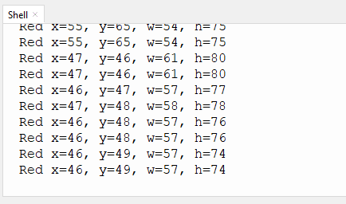

# 4.8 二维码 识别

## 4.8.1 算法简介


可以识别一个简单的二维码并返回该二维码的坐标、大小及文本内容。二维码信息不超过10个字符，屏幕上可显示ASCII码字符，如果是中文二维码，则无法正常显示，但识别结果可由主控正常读取。

-------------

## 4.8.2 返回数据

该算法的返回数据包括二维码位置坐标和宽度。

|           参数           |     属性信息      |
| :----------------------: | :---------------: |
|         kXValue          | 二维码中心横坐标x |
|         kYValue          | 二维码中心纵坐标y |
|       kWidthValue        |    二维码宽度w    |
|       kHeightValue       |    二维码高度h    |
| sengo1.GetQrCodeString() |  二维码内容文本   |

代码：

```python
        #获取二维码位置x
        x = sengo1.GetValue(sengo1_vision_e.kVisionQrCode, sentry_obj_info_e.kXValue)
        #获取二维码位置y
        y = sengo1.GetValue(sengo1_vision_e.kVisionQrCode, sentry_obj_info_e.kYValue)
        #获取二维码尺寸（宽度）w
        w = sengo1.GetValue(sengo1_vision_e.kVisionQrCode, sentry_obj_info_e.kWidthValue)
        #获取二维码尺寸（高度）h
        h = sengo1.GetValue(sengo1_vision_e.kVisionQrCode, sentry_obj_info_e.kHeightValue)
        #获取二维码内容文本
        text = sengo1.GetQrCodeString()
```

----------

## 4.8.3 如何生成二维码

我们有提供5个纸质的二维码卡片，二维码内容分别是“Red”，“Green”，“Blue”，“White”，“Black”。


如果我们提供的二维码满足不了你的需求，你可以通过下方的链接自己生成你需要的二维码。

[在线二维码生成器](https://cli.im/text/other)

进入链接后：

①选择文本

②输入需要生成的文字（注意避免中文字符与字符不得超过10个）

③点击生成二维码

④点击下载二维码图片


------------

## 4.8.4 代码

```python
from machine import I2C,UART,Pin
from  Sengo1  import *
import time

# 等待Sengo1完成操作系统的初始化。此等待时间不可去掉，避免出现Sengo1尚未初始化完毕主控器已经开发发送指令的情况
time.sleep(3)

# 选择UART或者I2C通讯模式，Sengo1出厂默认为I2C模式，短按模式按键可以切换
# 4种UART通讯模式：UART9600（标准协议指令），UART57600（标准协议指令），UART115200（标准协议指令），Simple9600（简单协议指令），
# port = UART(2,rx=Pin(16),tx=Pin(17),baudrate=9600)
port = I2C(0,scl=Pin(21),sda=Pin(20),freq=400000)

# Sengo1通讯地址：0x60。如果I2C总线挂接多个设备，请避免出现地址冲突
sengo1 = Sengo1(0x60)


err = sengo1.begin(port)
if err != SENTRY_OK:
    print(f"Initialization failed，error code:{err}")
else:
    print("Initialization succeeded")


err = sengo1.VisionBegin(sengo1_vision_e.kVisionQrCode)
if err != SENTRY_OK:
    print(f"Starting algo QrCode failed，error code:{err}")
else:
    print("Starting algo QrCode succeeded")
    
while True:
    # Sengo1不主动返回检测识别结果，需要主控板发送指令进行读取。读取的流程：首先读取识别结果的数量，接收到指令后，Sengo1会刷新结果数据，如果结果数量不为零，那么主控再发送指令读取结果的相关信息。请务必按此流程构建程序。
    obj_num = sengo1.GetValue(sengo1_vision_e.kVisionQrCode, sentry_obj_info_e.kStatus)
    if obj_num:
        #获取二维码位置x
        x = sengo1.GetValue(sengo1_vision_e.kVisionQrCode, sentry_obj_info_e.kXValue)
        #获取二维码位置y
        y = sengo1.GetValue(sengo1_vision_e.kVisionQrCode, sentry_obj_info_e.kYValue)
        #获取二维码尺寸（宽度）w
        w = sengo1.GetValue(sengo1_vision_e.kVisionQrCode, sentry_obj_info_e.kWidthValue)
        #获取二维码尺寸（高度）h
        h = sengo1.GetValue(sengo1_vision_e.kVisionQrCode, sentry_obj_info_e.kHeightValue)
        #获取二维码内容文本
        text = sengo1.GetQrCodeString()
        #打印二维码内容文本
        print(text,end='')
        #打印二维码位置与尺寸
        print(" x=%d, y=%d, w=%d, h=%d"%(x, y, w, h))
        time.sleep(0.2)    
```

-------

## 4.8.5 代码结果

上传代码后，AI视觉模块将会对摄像头拍到的地方进行分析如果有二维码就会进行识别，并且在串口监视器中打印二维码尺寸以及二维码的内容。


